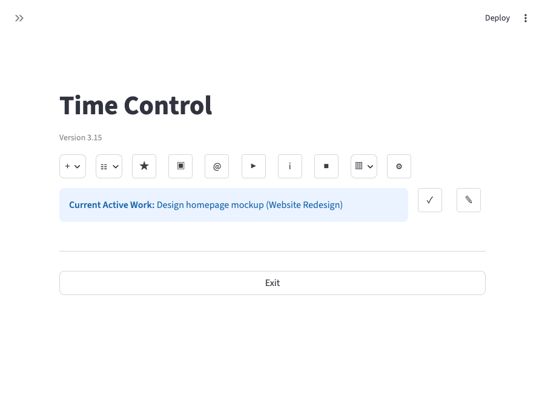
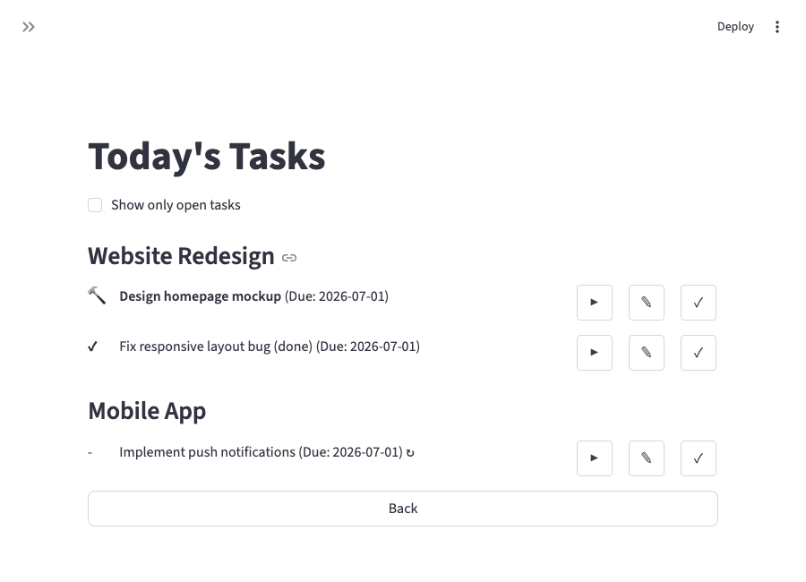
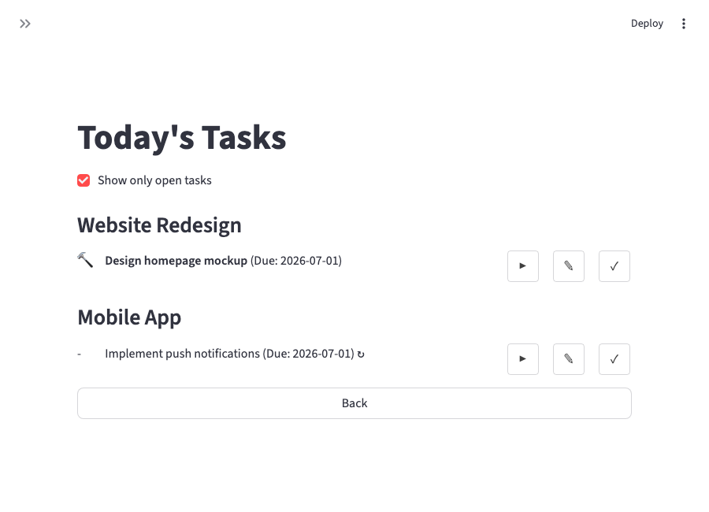
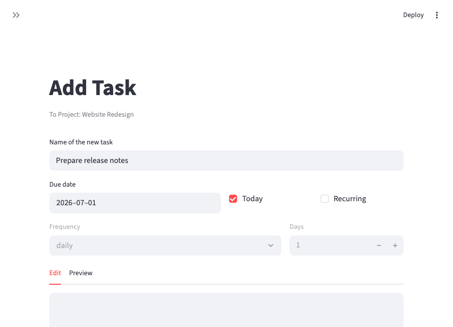
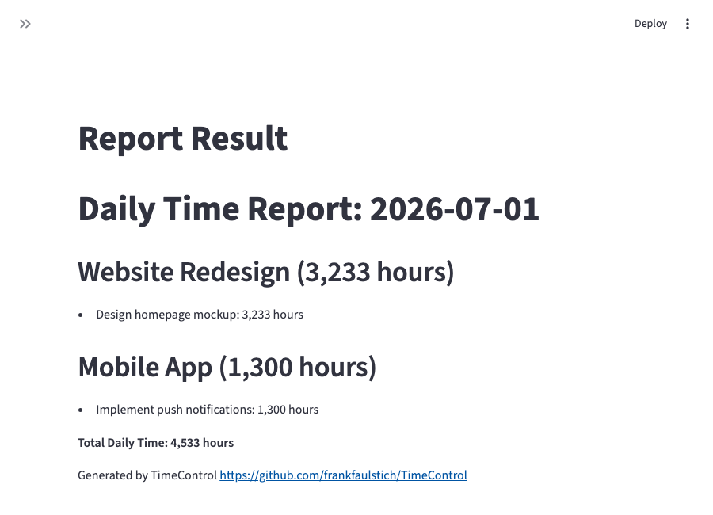

# Time Tracker Application ⏱️

A simple, object-oriented Python application for tracking time spent on projects and sub-projects. All data is stored locally in a `data.json` file.

> ⚠️ **Note:** The command-line interface (`TimeTrackerCLI.py`) is no longer actively maintained. All development effort now goes into the **Streamlit GUI** (`TimeTrackerSL_GUI.py`). New features, bug fixes, and translations will only be added there — please use the GUI going forward.

## Table of Contents

- [Time Tracker Application ⏱️](#time-tracker-application-️)
  - [Table of Contents](#table-of-contents)
  - [Features 🚀](#features-)
  - [Screenshots 📸](#screenshots-)
  - [Prerequisites 📋](#prerequisites-)
  - [Installation 🛠️](#installation-️)
  - [Configuration ⚙️](#configuration-️)
  - [Usage ⚙️](#usage-️)
    - [Running the Streamlit GUI](#running-the-streamlit-gui)
    - [Running the Interactive CLI (Deprecated)](#running-the-interactive-cli-deprecated)
    - [CLI Menu Options](#cli-menu-options)
  - [MCP Server 🤖](#mcp-server-)
  - [Building the Documentation 📚](#building-the-documentation-)
  - [Data Storage 🗄️](#data-storage-️)
  - [Contributing 🤝](#contributing-)
  - [License 📜](#license-)

---

## Features 🚀

**Project Management:** Create, list, rename, delete, close, re-open, move, promote, and demote main projects and tasks.

**Time Tracking:** Start, stop, and view the current work session. Automatically stops the previous session when a new one begins.

**Reporting & Analysis:**

- **Daily & Date Range Reports:** Generate detailed reports for specific days or periods.
- **Detailed Project Reports:** Create in-depth reports for individual main projects or tasks, including:
  - Total time, session count, and average session duration.
  - A timeline of first and last activity.
  - A breakdown of time spent per weekday (e.g., Monday: 2.5 hours, 30%).
  - For main projects, a summary of time distribution across its tasks.
  - For tasks, a day-by-day list of all time entries.
- **Inactivity Tracking:** Identify main projects and tasks that have been inactive for a configurable duration.

**Local Data Storage:** All project data and time entries are saved in a `data.json` file in the application's directory.

**Automatic Updates:** The application can check for new versions on GitHub upon exit and install them on the next start.

**Interface:**

- **Streamlit GUI:** A graphical, browser-based user interface (`TimeTrackerSL_GUI.py`) and the actively developed way to use TimeControl.
- **Interactive CLI (deprecated):** A command-line interface (`TimeTrackerCLI.py`) for task and project management. It is no longer maintained — see the note at the top of this document.

**SOAP API:** A full-featured SOAP web service (`TimeTrackerSOAP_Server.py`) to integrate TimeControl with other tools or dashboards. See [examples/SOAP](examples/SOAP) for runnable client examples.

**MCP Server (optional):** An [MCP](https://modelcontextprotocol.io/) server (`TimeTrackerMCP_Server.py`) that exposes the app's entire functionality — project/task management, time tracking, reporting, and email import — to an MCP client such as Claude Desktop, so you can manage TimeControl in natural language while keeping the GUI in sync — see [MCP Server](#mcp-server-) below.

**Unit Testing:** Includes comprehensive unit tests in `tests/test_TimeTracker.py` for feature reliability.

---

## Screenshots 📸

The Streamlit GUI groups all actions behind a compact icon toolbar — hover over an icon to see what it does, or click it to open the corresponding menu.

**Main menu:** the toolbar, plus the currently active work session (if any).



**Today's Tasks (★):** all tasks marked for today. The **Show only open tasks** checkbox above the list hides tasks that are already done.




**Adding a task:** set a due date, mark it for today, and optionally make it recurring.



**Reports:** generated as Markdown and automatically copied to the clipboard.



---

## Prerequisites 📋

- **Python 3.9 - 3.14:** Ensure you have Python 3 installed on your system. You can download it from [python.org](https://www.python.org/).
  *(Note: Python 3.14 is currently not supported on Windows due to dependency issues.)*

---

## Installation 🛠️

Clone the repository:

```bash
git clone https://github.com/FrankFaulstich/TimeControl.git
cd TimeControl
```

Install the required Python packages:

```bash
pip install -r requirements.txt
```

The application will also attempt to self-install missing dependencies on first run.

---

## Configuration ⚙️

The application can be configured via the `config.json` file.

```json
{
    "update": {
        "github_repo": "FrankFaulstich/TimeControl"
    },
    "language": "de",
    "streamlit_port": 8501,
    "soap_port": 8600,
    "mcp_server_enabled": false,
    "mcp_port": 8700,
    "data_file": "data.json",
    "css_file": "style.css"
}
```

- **`update.github_repo`**: The GitHub repository (username/reponame) to check for new versions.
- **`language`**: The user interface language ("en", "de", "fr", "es", "cs").
- **`soap_port`**: The port on which the SOAP server listens (default: 8600).
- **`mcp_server_enabled`**: Whether `TimeTrackerSL_GUI.py` also starts the MCP server (default: `false`). See [MCP Server](#mcp-server-).
- **`mcp_port`**: The port on which the MCP server listens (default: 8700).

---

## Usage ⚙️

### Running the Streamlit GUI

The GUI is the primary, actively developed way to use TimeControl (see [Screenshots](#screenshots-) above). To start it, run:

```bash
python TimeTrackerSL_GUI.py
```

or

```bash
python3 TimeTrackerSL_GUI.py
```

### Running the Interactive CLI (Deprecated)

> ⚠️ This interface is no longer actively maintained. It still works, but new features, bug fixes, and translations are only added to the Streamlit GUI going forward.

To start the interactive command-line interface, run:

```bash
python TimeTrackerCLI.py
```

or

```bash
python3 TimeTrackerCLI.py
```

### CLI Menu Options

The interactive CLI provides a structured menu for all operations.

**Main Menu:**

```text
=== Time Control [version] ===
--- Main Menu ---
1. Start work on task
2. Show current work
3. Stop current work
4. Handle projects and tasks
5. Reporting
6. Settings
--------------------------------
0. Exit
```

**Project Management Submenu (Option 4):**

```text
--- Project Management ---
1. Main Project Management
2. Task Management
--------------------------------
0.  Back to Main Menu
```

**Main Project Management Submenu:**

```text
--- Main Project Management ---
1.  Add Main Project
2.  List Main Projects
3.  Rename Main Project
4.  Close Main Project
5.  Re-open Main Project
6.  Delete Main Project
7.  List Inactive Main Projects
8.  Demote Main-Project to Sub-Project
9.  List Completed Main Projects
--------------------------------
0.  Back
```

**Task Management Submenu:**

```text
--- Task Management ---
1.  Add Task
2.  List Tasks
3.  Rename Task
4.  Close Task
5.  Re-open Task
6.  Delete Task
7.  Move Task
8.  List Inactive Tasks
9.  List All Closed Tasks
10. Delete All Closed Tasks
11. Promote Task to Main-Project
--------------------------------
0.  Back
```

**Reporting Submenu (Option 5):**

```text
--- Reporting ---
1. Daily Report (Today)
2. Daily Report (Specific Day)
3. Date Range Report
4. Detailed Task Report
5. Detailed Main-Project Report
6. Detailed Daily Report
--------------------------
0. Back to Main Menu
```

**Settings Submenu (Option 6):**

```text
--- Settings ---
1. Change Language
2. Restore Previous Version
3. Change Data Storage Location
--------------------------
0. Back to Main Menu
```

---

## MCP Server 🤖

TimeControl can optionally run a [Model Context Protocol](https://modelcontextprotocol.io/) server (`TimeTrackerMCP_Server.py`), letting an MCP client such as **Claude Desktop** talk to it directly — e.g. *"start work on task X"*, *"create a new project called Y"*, or *"stop what I'm working on"* — while you keep using the GUI at the same time. Both sides read and write the same `data.json`, and the GUI reloads its data on every interaction and (while the MCP server is enabled) also refreshes itself automatically every few seconds, so you can freely switch back and forth between Claude and the GUI.

**Enabling it:** set these two keys in `config.json` (see [Configuration](#configuration-️)) and install the extra dependency:

```bash
pip install mcp
```

```json
{
    "mcp_server_enabled": true,
    "mcp_port": 8700
}
```

With `mcp_server_enabled` set to `true`, `TimeTrackerSL_GUI.py` starts the MCP server automatically alongside the Streamlit GUI (and stops it again on exit), the same way it already can run the SOAP server. `mcp` requires Python 3.10+; on older versions the feature is simply unavailable.

You can also run it stand-alone instead:

```bash
python TimeTrackerMCP_Server.py
```

**Available tools:** the server exposes the full functional scope of the app as 33 tools:

- **Main project management:** `add_main_project`, `list_main_projects`, `rename_main_project`, `close_main_project`, `reopen_main_project`, `delete_main_project`, `demote_main_project`, `list_completed_main_projects`, `list_inactive_main_projects`.
- **Task management:** `add_task`, `list_tasks`, `update_task`, `mark_task_done`, `rename_task`, `close_task`, `reopen_task`, `delete_task`, `delete_all_closed_tasks`, `move_task`, `promote_task_to_project`, `list_inactive_tasks`, `cleanup_overdue_today_tasks`, `set_today_flag_for_due_tasks`.
- **Time tracking:** `start_work`, `stop_work`, `get_current_work`. Both the target project and task must already exist for `start_work` — it does not create them for you.
- **Reporting:** `generate_daily_report`, `generate_detailed_daily_report`, `generate_date_range_report`, `generate_task_report`, `generate_main_project_report`.
- **Email import:** `fetch_emails_to_tasks` (requires email import to be configured, see above).
- **Misc:** `get_version`.

`update_task` only changes the fields you actually pass — in particular, a task's due date is preserved automatically if you don't specify one, since updating it always requires re-sending the current value under the hood.

> ⚠️ **Destructive tools:** `delete_task`, `delete_all_closed_tasks`, and `delete_main_project` permanently delete data and cannot be undone. An MCP client should always confirm with you before calling them.

**Connecting Claude Desktop:** add an entry to Claude Desktop's MCP server configuration pointing at the Streamable HTTP endpoint, `http://127.0.0.1:8700/mcp` (adjust the port to match `mcp_port`). Consult Claude Desktop's current documentation for the exact steps, since how it's configured has changed between versions.

## Building the Documentation 📚

This project uses Sphinx to generate documentation from the docstrings in the source code.

1. **Install dependencies:**
    Make sure you have installed the required packages for building the docs:

    ```bash
    pip install -r requirements.txt
    ```

2. **Build the HTML documentation:**
    Navigate to the `docs` directory and use the `make` command:

    ```bash
    cd docs
    make html
    ```

    The generated documentation can be found in `docs/_build/html/index.html`.

---

## Data Storage 🗄️

All your project data, including main projects, tasks, and time entries, is automatically saved in a local file named **`data.json`** in the same directory as the script. This file is created upon the first run if it doesn't exist.

The `data.json` file has the following structure:

```json
{
  "projects": [
    {
      "main_project_name": "Example Main Project",
      "tasks": [
        {
          "task_name": "Example Task 1",
          "status": "open",
          "time_entries": [
            {
              "start_time": "YYYY-MM-DDTHH:MM:SS.ffffff",
              "end_time": "YYYY-MM-DDTHH:MM:SS.ffffff"
            },
            {
              "start_time": "YYYY-MM-DDTHH:MM:SS.ffffff"
              // "end_time" is missing if the entry is still active
            }
          ]
        },
        // ... other tasks
      ]
    },
    // ... other main projects
  ]
}
```

Time entries are stored in **ISO 8601 format** (e.g., `"2025-09-12T09:30:00.123456"`). If an `end_time` is missing for a `time_entry`, it means that time tracking is currently active for that task.

---

## Contributing 🤝

Contributions are welcome\! If you have any suggestions for improvements or new features, please feel free to:

- Fork the repository.
- Create a new branch (`git checkout -b feature/your-feature-name`).
- Make your changes.
- Commit your changes (`git commit -m 'Add some Feature'`).
- Push to the branch (`git push origin feature/your-feature-name`).
- Open a Pull Request.

Please ensure your code follows the existing style and **includes relevant unit tests** for new functionality.

---

## License 📜

This project is licensed under the **MIT License** - see the `LICENSE.md` file for details. (You might want to create a `LICENSE.md` file in your repository.)
