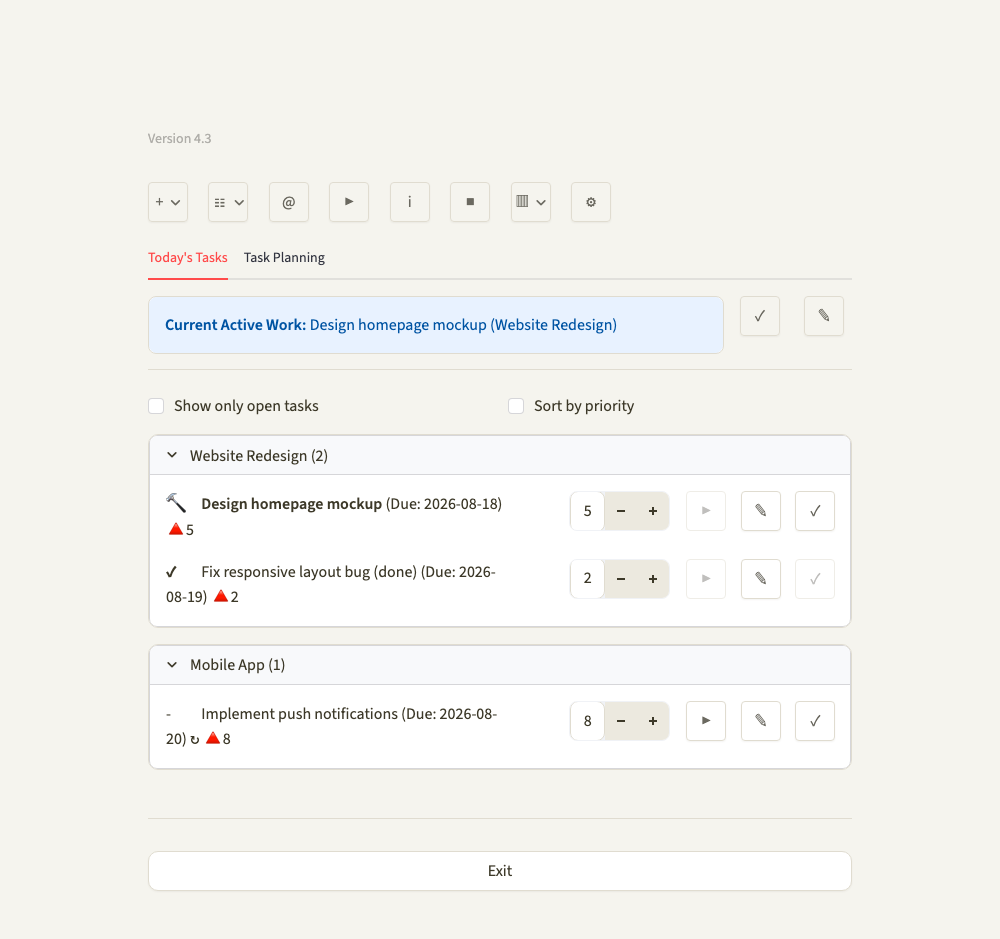
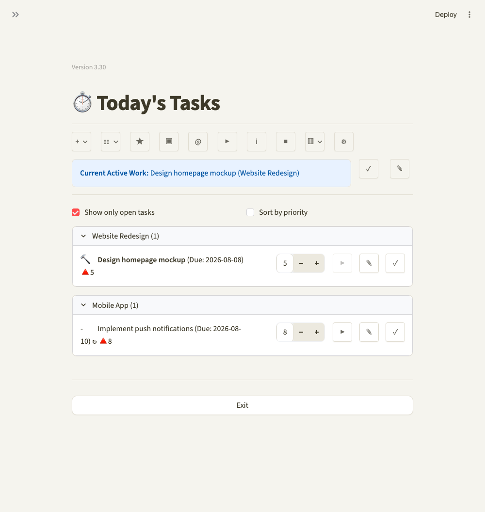
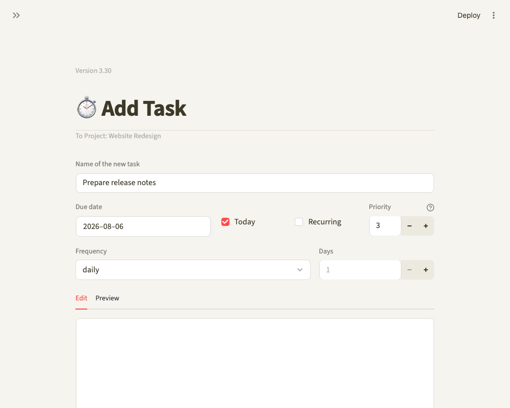
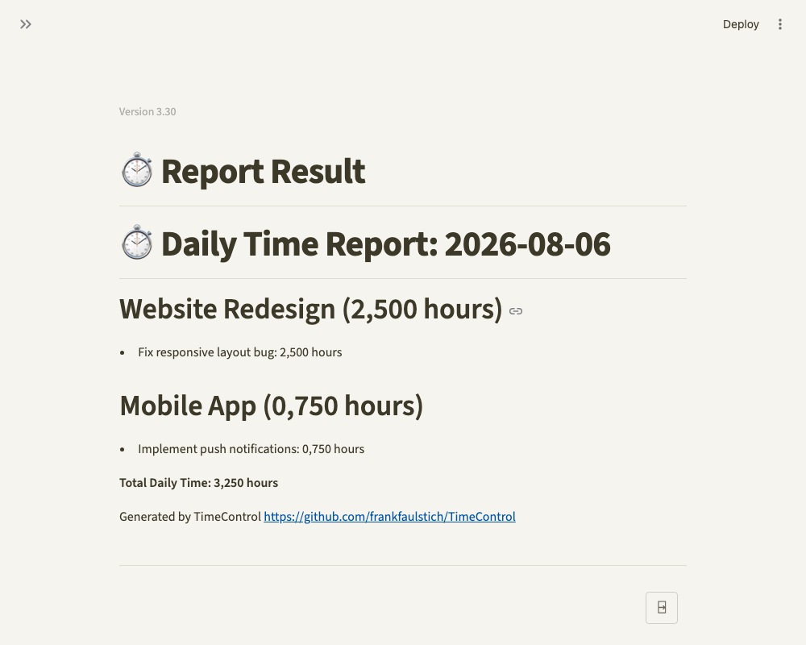

# Time Tracker Application ⏱️

A simple, object-oriented Python application for tracking time spent on projects and tasks. All data is stored locally in a `data.json` file.

## Table of Contents

- [Time Tracker Application ⏱️](#time-tracker-application-️)
  - [Table of Contents](#table-of-contents)
  - [Features 🚀](#features-)
  - [Screenshots 📸](#screenshots-)
  - [Prerequisites 📋](#prerequisites-)
  - [Installation 🛠️](#installation-️)
  - [Configuration ⚙️](#configuration-️)
  - [Usage ⚙️](#usage-️)
    - [Running the Streamlit GUI](#running-the-streamlit-gui)
  - [MCP Server 🤖](#mcp-server-)
  - [Synchronising Two Machines 🔄](#synchronising-two-machines-)
  - [Building the Documentation 📚](#building-the-documentation-)
  - [Translations 🌍](#translations-)
  - [Data Storage 🗄️](#data-storage-️)
  - [Contributing 🤝](#contributing-)
  - [License 📜](#license-)

---

## Features 🚀

**Project Management:** Create, list, rename, delete, close, re-open, move, promote, and demote main projects and tasks.

**Time Tracking:** Start, stop, and view the current work session. Automatically stops the previous session when a new one begins.

**Task Priorities:** Every task carries a priority from 0 (lowest, the default) to 9 (highest). Set it when adding or editing a task, adjust it inline right from the Today's Tasks list, and sort that list by priority with a single checkbox.

**Today's Tasks:** The app's default view. Shows every task marked for today, grouped by project, alongside the currently active work session with quick "done"/"edit" actions - no separate main menu to go through first.

**Start Dates:** A task can carry a start date as well as a due date. From that day until the due date it is listed under Today's Tasks by itself, which is how work that has to be picked up somewhere inside a stretch of days stops having to be either remembered or parked in today's list from the moment it is written down. A start date given on its own becomes the due date too, so the stretch always has both ends. When a recurring task rolls over, the start date moves with the due date and keeps the same gap.

The calendar tab draws the same stretch: a task appears on every day it runs, with the day it is wanted by left the darker of them, so a month shows how much room there is for a piece of work rather than only when it is over.

**Reporting & Analysis:**

- **Daily & Date Range Reports:** Generate detailed reports for specific days or periods.
- **Detailed Project Reports:** Create in-depth reports for individual main projects or tasks, including:
  - Total time, session count, and average session duration.
  - A timeline of first and last activity.
  - A breakdown of time spent per weekday (e.g., Monday: 2.5 hours, 30%).
  - For main projects, a summary of time distribution across its tasks.
  - For tasks, a day-by-day list of all time entries.
- **Inactivity Tracking:** Identify main projects and tasks that have been inactive for a configurable duration (tasks due today or in the future are never counted as inactive, since they're still actively scheduled). The task list also catches the opposite case: a task nobody ever started, whose due date went by at least that same duration ago. Both have to be true of it — a task with no due date says nothing about when it was last wanted, and one that came due this week is late rather than abandoned.

**Local Data Storage:** All project data and time entries are saved in a `data.json` file in the application's directory.

**Synchronisation (optional):** Keep one person's `data.json` in step across their own two or three computers, via a small PHP server you host yourself. Off by default, and everything above works exactly the same without it — see [Synchronising Two Machines](#synchronising-two-machines-) below.

**Automatic Updates:** The app checks GitHub for a new version once per session and, if one is available, shows a notification right under the version number on every screen, with a one-click button next to it.

Running from source, that button downloads the new release, installs it over the existing files and restarts into it. The Windows executable takes one step more, because Windows will not let a running program be overwritten: the button downloads the new build next to the current one and leaves it there, and the swap happens the next time you start the application — so a click is followed by one restart rather than none. The download is checked against the SHA-256 published with each release before anything is replaced.

The build it replaces is kept alongside as `TimeControl.exe.old`, and **Settings → Restore Previous Version** puts it back if a release turns out to disagree with your machine.

**Interface:**

- **Streamlit GUI:** A graphical, browser-based user interface (`TimeTrackerSL_GUI.py`).

**SOAP API:** A full-featured SOAP web service (`TimeTrackerSOAP_Server.py`) to integrate TimeControl with other tools or dashboards. See [examples/SOAP](examples/SOAP) for runnable client examples.

**REST API:** A REST web service (`TimeTrackerREST_Server.py`) covering the same operations as the SOAP API, for tools or dashboards that prefer JSON over SOAP/XML. See [examples/REST](examples/REST) for runnable client examples.

**MCP Server (optional):** An [MCP](https://modelcontextprotocol.io/) server (`TimeTrackerMCP_Server.py`) that exposes the app's entire functionality — project/task management, time tracking, reporting, and email import — to an MCP client such as Claude Desktop, so you can manage TimeControl in natural language while keeping the GUI in sync — see [MCP Server](#mcp-server-) below.

**Unit Testing:** Includes comprehensive unit tests in `tests/test_TimeTracker.py` for feature reliability.

---

## Screenshots 📸

The Streamlit GUI groups all actions behind a compact icon toolbar — hover over an icon to see what it does, or click it to open the corresponding menu. Below it, two tabs hold the day's work: **Today's Tasks** and **Task Planning**.

**Today's Tasks:** the default view on every start. The currently active work session (if any) and every task marked for today, grouped by project and showing its priority. The **Show only open tasks** and **Sort by priority** checkboxes filter and reorder the list.




**Adding a task:** set a start date and a due date, mark it for today, set a priority, and optionally make it recurring.



**Reports:** generated as Markdown and automatically copied to the clipboard.



---

## Prerequisites 📋

- **Python 3.10 - 3.14:** Ensure you have Python 3 installed on your system. You can download it from [python.org](https://www.python.org/).
  *(Note: Python 3.14 is currently not supported on Windows due to dependency issues.)*

---

## Installation 🛠️

Clone the repository:

```bash
git clone https://github.com/FrankFaulstich/TimeControl.git
cd TimeControl
```

Install the required Python packages:

```bash
pip install -r requirements.txt
```

The application will also attempt to self-install missing dependencies on first run.

---

## Configuration ⚙️

The application is configured through `config.json` in the project
directory. That file is **not** part of the repository: it is the live
file the Settings screen writes, so tracking it would publish whatever
you last configured - including, once, the address of your own sync
server. What ships instead is `config.example.json`, which spells out
the values the application uses when no configuration is present:

```bash
cp config.example.json config.json
```

Copying it is optional. Without it the application starts on exactly the
same settings and writes its own `config.json` on first use, and it
creates `data.json` for itself the same way - `data.example.json` is
there to show the shape, not to be copied.

```json
{
    "update": {
        "github_repo": "FrankFaulstich/TimeControl"
    },
    "language": "de",
    "streamlit_port": 8501,
    "soap_port": 8600,
    "rest_port": 8800,
    "mcp_server_enabled": false,
    "mcp_transport": "http",
    "mcp_port": 8700,
    "data_file": "data.json",
    "css_file": "style.css",
    "sync": {
        "enabled": false,
        "base_url": "https://example.com/tc/",
        "interval_minutes": 5,
        "log_enabled": false
    }
}
```

- **`update.github_repo`**: The GitHub repository (username/reponame) to check for new versions. Optional: left out, the application asks about its own releases, which is what the Windows build needs — it ships as a single `.exe` and writes itself a `config.json` that has no repository in it. Set it to point a fork somewhere else, or to `""` to switch the update check off entirely.
- **`language`**: The user interface language ("en", "de", "fr", "es", "cs").
- **`soap_port`**: The port on which the SOAP server listens (default: 8600).
- **`rest_port`**: The port on which the REST server listens (default: 8800). See [examples/REST](examples/REST) for runnable client examples.
- **`mcp_server_enabled`**: Whether `TimeTrackerSL_GUI.py` also starts the MCP server when `mcp_transport` is `"http"` (default: `false`). See [MCP Server](#mcp-server-).
- **`mcp_transport`**: `"http"` or `"stdio"` (default: `"http"`). See [MCP Server](#mcp-server-).
- **`mcp_port`**: The port on which the MCP server listens when using the `"http"` transport (default: 8700).
- **`sync`**: Optional, and absent by default — which means off. `enabled` switches synchronisation on, `base_url` is the address of your own server, `interval_minutes` is how often it runs in the background (default: 5), and `log_enabled` turns on a diagnostic log (default: off). Changing `base_url` after signing in takes effect once you sign in again: the access token belongs to the server that issued it, so it is never sent to a different address. The settings screen shows which address is in use and says so when the two differ. See [Synchronising Two Machines](#synchronising-two-machines-).

All of these MCP settings can also be changed from the GUI, under **Settings → MCP Server Settings**, and the sync settings under **Settings → Sync Server Settings**.

Your sync **username and password are deliberately not in this file.** Signing in stores an access token in the per-user configuration directory instead — `%APPDATA%\TimeControl\` on Windows, `~/.config/TimeControl/` elsewhere. That way you can copy `config.json` to your second machine to give it the same server without handing it your credentials, and the token never travels with the project directory into a backup or a repository.

---

## Usage ⚙️

### Running the Streamlit GUI

The GUI is the way to use TimeControl (see [Screenshots](#screenshots-) above). To start it, run:

```bash
python TimeTrackerSL_GUI.py
```

or

```bash
python3 TimeTrackerSL_GUI.py
```

---

## MCP Server 🤖

TimeControl can optionally run a [Model Context Protocol](https://modelcontextprotocol.io/) server (`TimeTrackerMCP_Server.py`), letting an MCP client such as **Claude Desktop** talk to it directly — e.g. *"start work on task X"*, *"create a new project called Y"*, or *"stop what I'm working on"* — while you keep using the GUI at the same time. Both sides read and write the same `data.json`, and the GUI reloads its data on every interaction. It also refreshes itself automatically every few seconds — whenever `mcp_server_enabled` is `true`, and always when `mcp_transport` is `"stdio"` (since a stdio client can be talking to the server independently of that flag, see below) — so you can freely switch back and forth between Claude and the GUI.

It supports two transports, chosen via `mcp_transport` in `config.json`:

- **`http`** (default): a Streamable HTTP server the GUI starts and stops for you as a background process, the same way it already can run the SOAP server. Multiple clients can connect to it at once.
- **`stdio`**: the MCP client (e.g. Claude Desktop) launches `TimeTrackerMCP_Server.py` itself and talks to it over its stdin/stdout - nothing needs to be running beforehand. This is the transport Claude Desktop supports most reliably, so prefer it when connecting Claude Desktop.

**Enabling it:** install the extra dependency and configure it either through the GUI (**Settings → MCP Server Settings**) or directly in `config.json` (see [Configuration](#configuration-️)):

```bash
pip install mcp
```

```json
{
    "mcp_server_enabled": true,
    "mcp_transport": "http",
    "mcp_port": 8700
}
```

With `mcp_server_enabled` set to `true` and `mcp_transport` set to `"http"`, `TimeTrackerSL_GUI.py` starts the MCP server automatically alongside the Streamlit GUI (and stops it again on exit). With `mcp_transport` set to `"stdio"`, the GUI does *not* start it - there is nothing useful for it to start, since a stdio server only makes sense spawned directly by its client - and `mcp_server_enabled`/`mcp_port` are then not used. `mcp` requires Python 3.10+; on older versions the feature is simply unavailable.

You can also run it stand-alone instead (it reads `mcp_transport` from `config.json` the same way):

```bash
python TimeTrackerMCP_Server.py
```

**Available tools:** the server exposes the full functional scope of the app as 33 tools:

- **Main project management:** `add_main_project`, `list_main_projects`, `rename_main_project`, `close_main_project`, `reopen_main_project`, `delete_main_project`, `demote_main_project`, `list_completed_main_projects`, `list_inactive_main_projects`.
- **Task management:** `add_task`, `list_tasks`, `update_task`, `mark_task_done`, `rename_task`, `close_task`, `reopen_task`, `delete_task`, `delete_all_closed_tasks`, `move_task`, `promote_task_to_project`, `list_inactive_tasks`, `cleanup_overdue_today_tasks`, `set_today_flag_for_due_tasks`.
- **Time tracking:** `start_work`, `stop_work`, `get_current_work`. Both the target project and task must already exist for `start_work` — it does not create them for you.
- **Reporting:** `generate_daily_report`, `generate_detailed_daily_report`, `generate_date_range_report`, `generate_task_report`, `generate_main_project_report`.
- **Email import:** `fetch_emails_to_tasks` (requires email import to be configured, see above).
- **Misc:** `get_version`.

`update_task` only changes the fields you actually pass — a task's dates included, so omitting them leaves them as they are. Removing one is a separate request: pass `clear_due_date` or `clear_start_date`.

> ⚠️ **Destructive tools:** `delete_task`, `delete_all_closed_tasks`, and `delete_main_project` permanently delete data and cannot be undone. An MCP client should always confirm with you before calling them.

**Connecting Claude Desktop:** the recommended way is the **stdio** transport - set `"mcp_transport": "stdio"` (via the GUI or `config.json`) and add an entry to Claude Desktop's MCP server configuration that launches the script directly:

```json
{
    "mcpServers": {
        "timecontrol": {
            "command": "python3",
            "args": ["/absolute/path/to/TimeTrackerMCP_Server.py"]
        }
    }
}
```

Use the absolute path to the script - Claude Desktop (like most MCP clients) launches it with an undefined working directory, not necessarily the repo root, and does not reliably support a `cwd` override for that even though some setups suggest one. The server accounts for this itself: it always resolves `config.json`/`data.json` relative to its own location on disk, not the process's working directory, so no `cwd` entry is needed.

Claude Desktop then starts and stops the server itself - it does not need to be running beforehand, and the GUI does not start a second copy of it (see above). Alternatively, with `"mcp_transport": "http"` and the server running (either via the GUI or stand-alone), point Claude Desktop at the Streamable HTTP endpoint, `http://127.0.0.1:8700/mcp` (adjust the port to match `mcp_port`), instead. Consult Claude Desktop's current documentation for the exact configuration steps, since these have changed between versions.

## Synchronising Two Machines 🔄

TimeControl can keep **one person's** `data.json` in step across their own two or three computers — a desktop and a laptop, say. It is entirely optional and off by default: without it the application works exactly as it always has, storing everything locally and talking to nobody.

This is deliberately **not** a collaboration feature. There is one document per account, and it is yours.

### What you need

A `data.json` cannot simply be copied back and forth — whichever copy is written last would silently destroy the other machine's afternoon. So the machines exchange *intentions* ("set the priority of task X to 3") through a small server that you host, which keeps them in an append-only log and hands each machine whatever it has not seen yet.

That server is in [`php-server/`](php-server/). It is plain PHP with no database and no dependencies, and it runs on ordinary shared web hosting — the kind with an FTP login and no shell access. Installation, the security model and the exact API are described in [php-server/README.md](php-server/README.md).

### Setting it up

1. Upload the contents of `php-server/tc/` to your web space and run the installer once, following [php-server/README.md](php-server/README.md). Create yourself an account while you are there.
2. In the GUI, open **Settings → Sync Server Settings**.
3. Enter the **server address** (it must start with `https://`), tick **Enable synchronisation**, and press **Save**. Save it before signing in — the sign-in reads the address from disk, not from the text box.
4. Enter your **username** and **password** and press **Sign in**.
5. Repeat steps 2–4 on the second machine.

Whichever machine reaches an empty server first offers what it already has. A machine joining later offers its own document too, so nothing built up before you switched synchronisation on is left behind.

### How it behaves

Synchronisation runs in the background, every few minutes and whenever you switch to a different view. **Nothing in the interface ever waits for it** — a server that has gone away costs you a sync, never a pause. Changes you make while offline queue up and go out when the connection returns.

When the same task is edited on both machines, changes to *different* fields both survive; for the *same* field, whichever reached the server later wins. Starting work on one machine ends a session left running on the other, at the moment the new one began, so no stretch of time is counted twice.

**Deleting a task discards its recorded hours on both machines.** That is what deleting has always done locally, and both sides have to agree or the two documents drift apart. If work was booked on the other machine and had not yet been sent when you deleted the task, it is gone — the app says so rather than letting it pass unnoticed, but it cannot bring it back.

The status line under the version number appears only when something needs you — a sign-in that has expired, or time that was discarded. **Settings → Sync Server Settings** shows when the last sync ran and how much is still waiting to be sent.

### When something looks wrong

**Settings → Sync Server Settings → Write a diagnostic log** records what
synchronisation actually did — what was sent, what came back, where the cursor
got to, and why it gave up. It is off by default and writes nothing until you
switch it on.

The log holds counts, error codes, sequence numbers and identifiers, and
deliberately no project names, task names, notes, usernames or server
addresses: it is meant to be readable by whoever is helping you without also
handing them a list of everything you worked on. It lives beside the other
per-machine sync files, caps itself at about a megabyte, and the settings
screen shows the recent entries with buttons to save or clear them.

Two failures have a cause that is not in the log, because it is in how the server is reached:

**Every request answers `https_required`, although the address is https.** The server decides whether a request arrived over TLS from `$_SERVER['HTTPS']`, or failing that from the port. Behind a front end that terminates TLS and speaks to PHP in the clear, neither says so, and the server refuses everything. Set `'https' => 'proxy'` in `tc/config.php` and it will believe `X-Forwarded-Proto` instead — but only do that with a real proxy in front, because otherwise that header is the client's to invent. The other way, `'strict'`, turns off the guess by port: the tightest setting, and right wherever the server sets the variable itself. `'auto'` is the default and what every installation had before the setting existed.

**The client reports that the address redirects.** It will not follow one. The access token travels in a header `requests` does not recognise as a credential, so it would be carried on to wherever the redirect pointed, plain http included. Enter the address the redirect points to — usually a missing `www.`, or `http` where `https` was meant.

### End-to-end encryption 🔐

Off by default. Without it, everything the sync server holds — project and task names, notes, the times you worked — sits on its disk as readable JSON. File permissions and an `.htaccess` keep the web out, but not the hosting account, and not whoever runs the machine. On shared hosting that is a real audience.

Switched on, the client seals every operation before it leaves, and the server stores and hands on something it cannot read. It never learns the passphrase and never could: the key is derived on your own machines.

**Before you switch it on,** update the sync server and every device. An older server refuses encrypted data outright, which is loud and harmless. An older *device* is the dangerous one — it does not recognise the sealed operations and would quietly stop receiving anything at all.

**Setting it up.** Sign in first (the account name is sealed into every operation, so it has to be known). Then, in *Sync Server Settings → End-to-end encryption*, choose a passphrase and type it twice. It is **not** your account password, and it is never sent anywhere.

For a second device: copy `config.json` across — it carries the salt, which is not secret but has to be the same everywhere — and enter the same passphrase there. Then compare the **key fingerprint** shown on both. Nothing on either machine can tell a mistyped passphrase from a correct one; it simply produces a different key. The fingerprint is the only check there is, and comparing it takes a second.

**There is no recovery.** Lose the passphrase and everything the server holds is lost with it. Nobody — not the server, not the hosting provider, not us — can get it back. Write it down somewhere safe before you switch this on.

**What it does not hide.** The server still sees how many projects, tasks and time entries exist, and when you worked: the timestamps travel in the clear because the ordering depends on them. It sees which device did what and when each one last called in, and your device name and IP address. A curious host can reconstruct your working hours in detail — just not what you were working on.

**What it holds the server to.** Encryption stops the server reading; it does not by itself stop it meddling. Two things it might try are caught. Each operation says inside its own ciphertext which device sealed it, so relabelling one machine's work as another's no longer passes. And each device's counter has to keep rising, so an operation played a second time, or two swapped round, are refused — the cycle stops without applying anything and without moving its cursor.

Two things are deliberately *not* treated as attacks. A gap in a device's counters is not one: the queue raises its number before writing the line, so a failed write burns one for good, and stopping the sync over a full disk would be worse than the withholding it would claim to detect. Gaps go to the diagnostic log and no further. And the order *between* devices is not checked at all, because there is nothing to check it against — which of two machines' edits wins is decided by the sequence number, and the server hands those out. A server that simply never passes another device's work on is likewise invisible: absence of something you were never told about leaves no trace.

**Switching over an existing account.** Turning it on does not reach back. Everything synchronised before stays in the server's log exactly as it was, and only a sealed summary of the whole document takes those segments out of it. The client does that by itself within the next few syncs, and the settings screen says plainly which of the two states you are in. Two caveats: the old segments are then out of the reading path but stay on the server's disk for at least seven days, and the identifiers of objects that already existed do not change — anyone who kept a copy of the old log can still tell which encrypted object is which, and what it used to be called. Encryption protects what you write from here on; it cannot un-publish what was already there.

**Switching it off** stops new work being sealed and keeps both the key and the account's salt, so what is already on the server stays readable to you. Switching it back on therefore asks for nothing: the same passphrase as before still applies, and anything sent while it was off stays unencrypted where it is. Forgetting the key is a separate, deliberate action, and it cannot be undone.

**Changing the passphrase** is in the same place, under *Change the passphrase*. It either happens completely or not at all: the device seals the whole document with the new key and waits for the server to accept it, and only then does the new passphrase become the account's. If anything goes wrong — the server is unreachable, another machine pushed in between — nothing has changed and the old passphrase still applies. That is why it asks you to be fully synchronised first.

Afterwards, enter the new passphrase on your other devices too. Until you do, they stop synchronising and say why; nothing is lost while they wait. They keep their old key alongside the new one, because the log still holds work sealed with it — including their own.

Starting over with a *forgotten* passphrase is a different thing and means removing the `e2ee` block from `config.json` by hand. That is deliberately out of reach of a stray click, because it makes everything already on the server unreadable to everybody.

### Limitations worth knowing

All four entry points drive synchronisation now — the GUI, and the MCP, REST and SOAP servers. Each brings the document up to date and starts the background worker when it loads the document for a request, so a machine driven only through Claude Desktop no longer waits for somebody to open the GUI before its changes leave.

Once the log has run far enough past its last snapshot, whichever machine is fully caught up offers the server its document as a new one, and the server sets aside the operations that snapshot now speaks for. A machine joining later takes the snapshot and then only what came after it, instead of replaying the whole history. This happens on its own; there is nothing to switch on.

The one thing it costs: a machine out of contact for more than ninety days can see an object it deleted come back, because the deletion has aged out of the snapshot's records and the log no longer reaches back that far. It is visible, and deleting the object again fixes it. The alternative — treating the snapshot as the whole truth and removing anything it does not mention — would silently discard work that was never sent, which is the worse of the two.

---

## Building the Documentation 📚

This project uses Sphinx to generate documentation from the docstrings in the source code.

1. **Install dependencies:**
    Sphinx itself, and the application's own dependencies as well - autodoc documents a module by importing it, so a missing package means a missing chapter:

    ```bash
    pip install -r requirements.txt -r docs/requirements.txt
    ```

2. **Build the HTML documentation:**

    ```bash
    sphinx-build -b html -W --keep-going docs docs/_build/html
    ```

    The generated documentation can be found in `docs/_build/html/index.html`.

    `-W` turns Sphinx's warnings into errors, which is what CI does. Without it, a module autodoc cannot import is mentioned once in the log and the page is built without it, looking complete. `cd docs && make html` still works and is more forgiving.

Every module the application is built from is listed in `docs/modules.rst`. `tests/test_documentation.py` fails if one is added and not listed there, or if a name listed there stops resolving to a module.

---

## Translations 🌍

The interface is available in English, German, French, Spanish and Czech. The catalogues live in `locale/<lang>/LC_MESSAGES/`.

Only four files carry translatable text, and the extraction has to name all of them — a module left out keeps working and quietly stops being translated, which nothing reports:

```bash
xgettext --language=Python --keyword=_ --from-code=UTF-8 -o locale/timetracker.pot sl/SL_Menu.py tt/TimeTracker.py tt/sync_messages.py update.py
```

Add the new entries to each `.po` by hand rather than through `msgmerge`: it marks entries `#, fuzzy`, and `msgfmt` then drops them without a word, so a missing translation hides behind a clean build. Compile with the check enabled, and read the count — it should report neither fuzzy nor untranslated messages:

```bash
msgfmt --check-format --statistics -o locale/de/LC_MESSAGES/timetracker.mo locale/de/LC_MESSAGES/timetracker.po
```

---

## Data Storage 🗄️

All your project data, including main projects, tasks, and time entries, is automatically saved in a local file named **`data.json`** in the same directory as the script. This file is created upon the first run if it doesn't exist.

The `data.json` file has the following structure:

```json
{
  "schema_version": 2,
  "next_id": 7,
  "projects": [
    {
      "uid": "9f3a1c40b27e5d81",
      "main_project_name": "Example Main Project",
      "status": "open",
      "last_started": "YYYY-MM-DDTHH:MM:SS.ffffff",
      "tasks": [
        {
          "uid": "1b7c9e02a4d6f835",
          "id": 3,
          "task_name": "Example Task 1",
          "status": "open",
          "priority": 0,
          "last_started": "YYYY-MM-DDTHH:MM:SS.ffffff",
          "time_entries": [
            {
              "uid": "c5e8017da39b642f",
              "start_time": "YYYY-MM-DDTHH:MM:SS.ffffff",
              "end_time": "YYYY-MM-DDTHH:MM:SS.ffffff"
            },
            {
              "uid": "77aa10bc9e3d5f24",
              "start_time": "YYYY-MM-DDTHH:MM:SS.ffffff"
              // "end_time" is missing if the entry is still active
            }
          ]
        },
        // ... other tasks
      ]
    },
    // ... other main projects
  ],
  "_deleted": [
    { "uid": "0e4d8f21ab6c37e9", "kind": "task", "at": "YYYY-MM-DDTHH:MM:SS.ffffff" }
  ]
}
```

Time entries are stored in **ISO 8601 format** (e.g., `"2025-09-12T09:30:00.123456"`). If an `end_time` is missing for a `time_entry`, it means that time tracking is currently active for that task.

Older files are migrated automatically the first time they are opened; nothing needs to be done by hand. The fields added in schema 2 exist for [synchronisation](#synchronising-two-machines-) and are harmless without it:

- **`uid`** — a 16-character identifier on every project, task and time entry, generated where the object was created and never reused. It is what lets two machines agree that they are talking about the same task even though each numbers its own.
- **`id`** — the short integer handle used by the GUI and the MCP/REST/SOAP calls. Local to one machine, and the same task may carry different ones on different computers.
- **`last_started`** — when work on this project or task last began, so "most recently used" survives a merge rather than depending on the order of a list.
- **`_deleted`** — a record of what has been deleted, kept for 90 days. Without it a deletion here plus any edit there would resurrect the object on the next sync, and again on every sync after that.

---

## Contributing 🤝

Contributions are welcome\! If you have any suggestions for improvements or new features, please feel free to:

- Fork the repository.
- Create a new branch (`git checkout -b feature/your-feature-name`).
- Make your changes.
- Commit your changes (`git commit -m 'Add some Feature'`).
- Push to the branch (`git push origin feature/your-feature-name`).
- Open a Pull Request.

Please ensure your code follows the existing style and **includes relevant unit tests** for new functionality.

---

## License 📜

This project is licensed under the **MIT License** - see the `LICENSE.md` file for details. (You might want to create a `LICENSE.md` file in your repository.)
